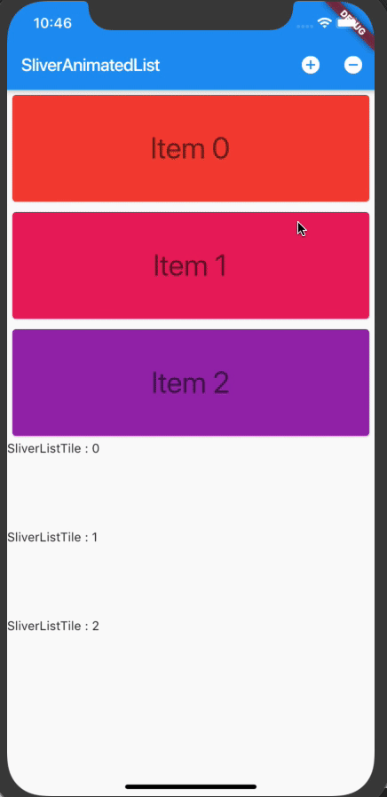

# sliver_animated_list

[](https://pub.dev/packages/sliver_animated_list)
[](https://dev.azure.com/dietfriends/Flutter%20-%20Sliver%20Animated%20List/_build/latest?definitionId=9&branchName=master)

Animated List to Sliver



## How to use
```
      Center(
        // Center is a layout widget. It takes a single child and positions it
        // in the middle of the parent.
        child: CustomScrollView(
          // Column is also layout widget. It takes a list of children and
          // arranges them vertically. By default, it sizes itself to fit its
          // children horizontally, and tries to be as tall as its parent.
          //
          // Invoke "debug painting" (press "p" in the console, choose the
          // "Toggle Debug Paint" action from the Flutter Inspector in Android
          // Studio, or the "Toggle Debug Paint" command in Visual Studio Code)
          // to see the wireframe for each widget.
          //
          // Column has various properties to control how it sizes itself and
          // how it positions its children. Here we use mainAxisAlignment to
          // center the children vertically; the main axis here is the vertical
          // axis because Columns are vertical (the cross axis would be
          // horizontal).
          slivers: <Widget>[
            SliverAnimatedList(
              key: _listKey,
              initialItemCount: _list.length,
              itemBuilder: _buildItem,
            ),
            SliverList(
              delegate: SliverChildBuilderDelegate(
                (BuildContext context, int i) {
                  return Container(
                    height: 100,
                    child: Text('SliverListTile : $i'),
                  );
                },
                childCount: 3,
              ),
            ),
          ],
        ),
      ),
```
